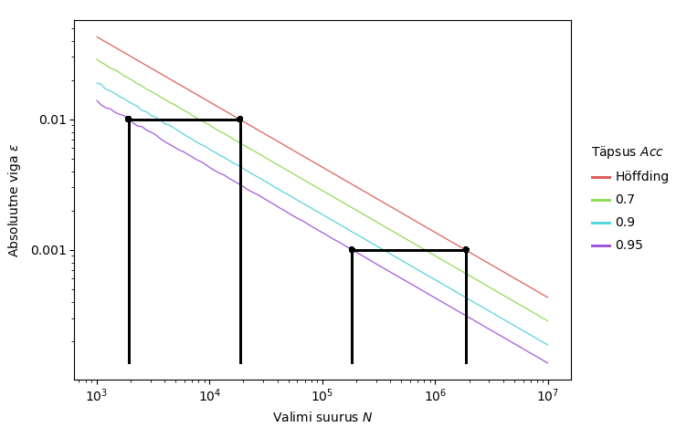

# Masinõppe meetodite hindamine väheste märgenditega andmetel

### Lühikokkuvõte
Klassifitseerimisülesandeid lahendavate masinõppe mudelite hindamiseks kasutatakse kvaliteedimõõte nagu õigsus täpsus ja saagis. Nimetatud suurused või nende hinnangud avalduvad andmepunktide tegelike klassimärgendite ja meetodi klassifikatsioonide kaudu. Tegelike klassimärgendite leidmiseks peab need manuaalselt üle vaatama. Sageli hinnatakse kvaliteedimõõte üle lõpliku valimi, leitud hinnangud sisaldavad vigu. Antud töö käigus leiti kui suurt valimit on vaja, et mingi kindlusega ei ületaks hinnangu viga selle lubatud piiri.

Lisaks peab valimi puhul õigsuse, täpsuse või saagise hindamiseks definitsiooni põhjal leidma kõikide valimi andmepunktide märgenind. Kui lisaks hinnatavale klassifitseerimismeetodile on olemas teine meetod, saab seda kasutada uue hinamiseks. Seejuures on võimalik märgendamiseks vajalikku manuaalset tööd vähendada, uurides uue meetodi kvaliteedimõõdu arvutamise asemel, kui palju on uus meetod vanast parem. Töös uuriti tehnikaid, mis aitavad vähendada märgendamist vajavate andmepunktida arvu kahe klassifitseerimismeetodi kvaliteedimõõtude vahede hinadmiseks.

