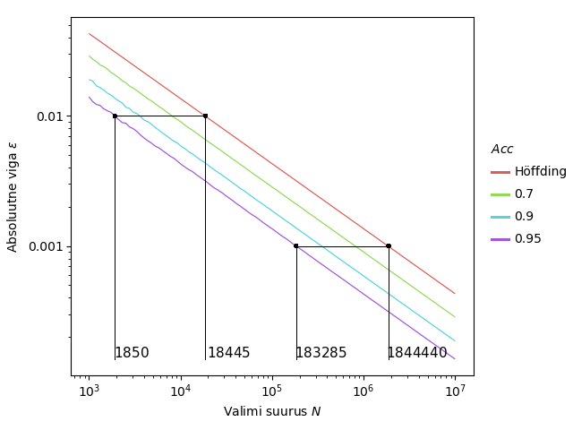
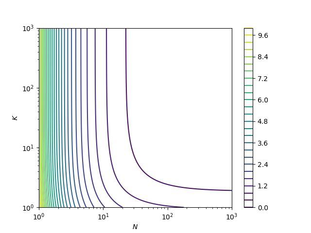

# Masinõppe meetodite hindamine väheste märgenditega andmetel

### Lühikokkuvõte
Klassifitseerimisülesandeid lahendavate masinõppe mudelite hindamiseks kasutatakse kvaliteedimõõte nagu õigsus täpsus ja saagis. Need suurused või nende hinnangud avalduvad andmepunktide tegelike klassimärgendite ja meetodi klassifikatsioonide kaudu. Tegelike klassimärgendite leidmiseks peame need manuaalselt üle vaatama. Sageli hinnatakse kvaliteedimõõte üle lõpliku valimi, leitud hinnangud sisaldavad vigu. Antud töö käigus avaldame vajaliku valimi suuruse, et mingi kindlusega ei ületaks hinnangu viga selle lubatud piiri.

Lisaks peame valimi puhul õigsuse, täpsuse või saagise hindamiseks definitsiooni põhjal leidma kõikide valimi andmepunktide märgendid. Kui lisaks hinnatavale klassifitseerimismeetodile on olemas teine meetod, saame seda kasutada esimese hindamiseks. Seejuures on võimalik märgendamiseks vajalikku manuaalset tööd vähendada, kui uurime uue meetodi kvaliteedimõõdu arvutamise asemel kui palju on uus meetod vanast parem. Töös uurime tehnikaid, mis aitavad vähendada märgendamist vajavate andmepunktida arvu kahe klassifitseerimismeetodi kvaliteedimõõtude vahede hindamiseks.

